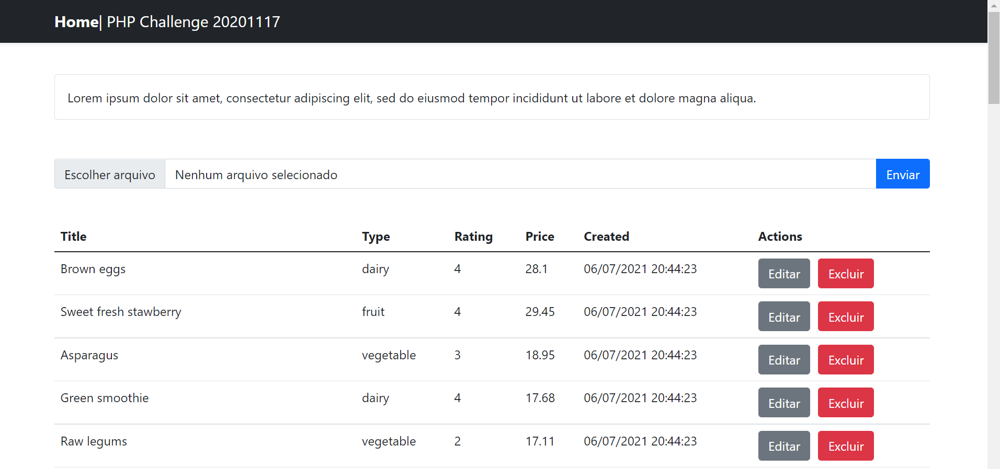
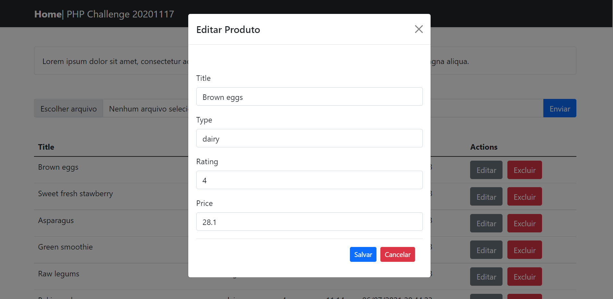

# challenge-products

products CRUD with a REST API: https://github.com/karoldiasb/api-challenge-products

[](./public/php_challenge.png)    

[](./public/php_challenge_edit.png)    


## Project setup
```
npm install
```

### Compiles and hot-reloads for development
```
npm run serve
```
